## notes

- use UAS facility map to do pre-fly planning, green squares on the map means we can use LAANC, and the number in the grids means the max. height, 0 means not allowed to fly above 0 ft.  

- easiest way to get authorization is LAANC, as long as your flight height is below the max. limit, then it's granted as soon as you apply, but you still need to apply, this applies for recreation/academic flight. if you want to go above the max. limit, we need a manual approval via LAANC, but you need a part 107 license first.

- LAANC is available via Airmap

- DroneZone is only for applications not eligible for LAANC

- in San Diego Imperial Beach, we can fly under "other times class G", and we do not need authorization, i.e. we can fly there during weekends and public holidays. However, there may be people on the beach, so may still not be safe to fly there.  

- you are responsible for yielding to all other traffic, refer to see and avoid below

## slides

- [link](https://docs.google.com/presentation/d/1rxDAgzTZgOP6sfVWcOLmlqGy9NxeYiiCHgvVpHEyYrw/present?slide=id.g80c3e2ec2b_2_87)

- selected slides

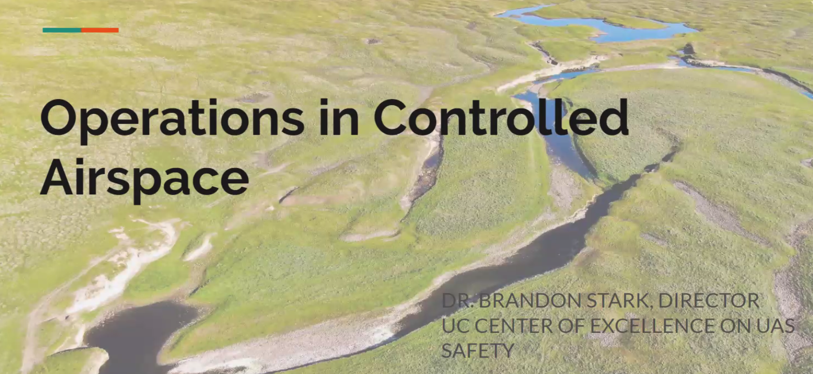
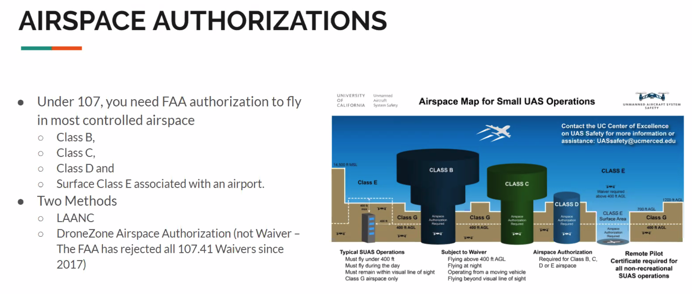
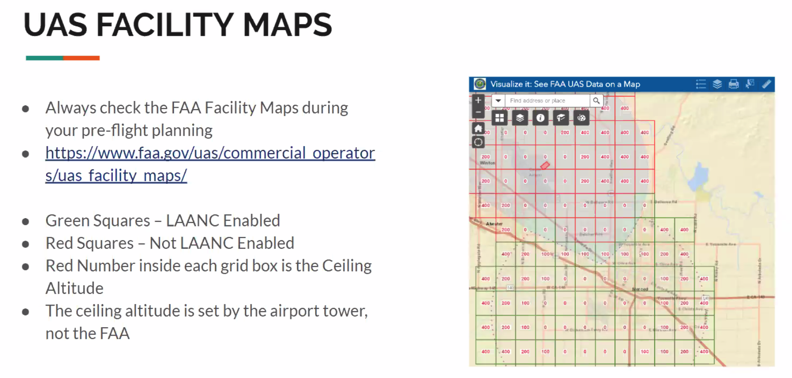
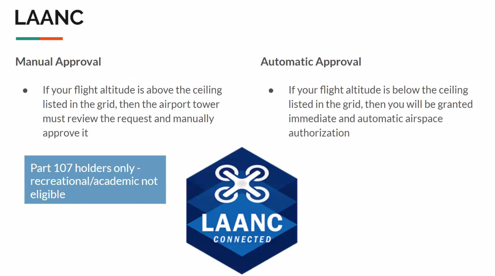
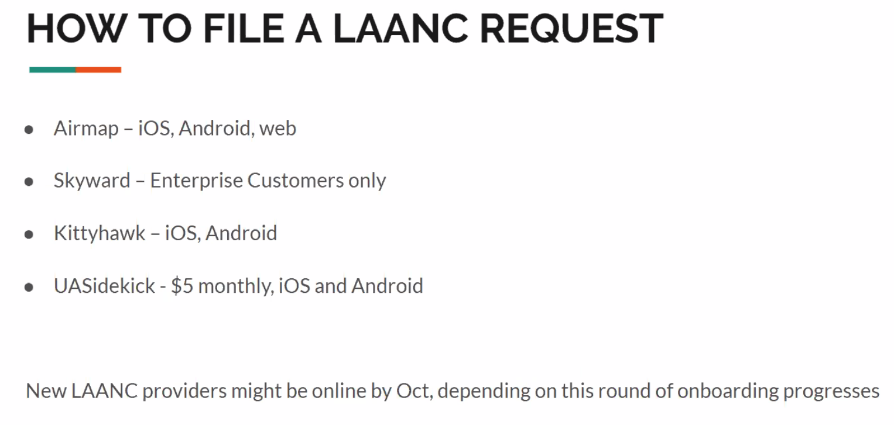
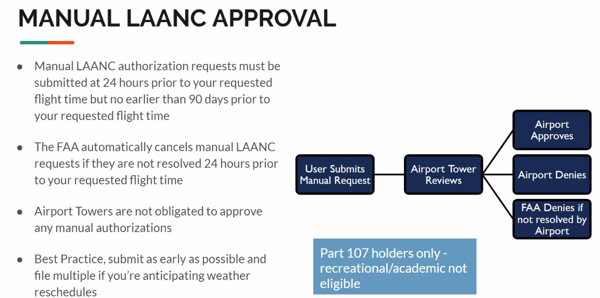
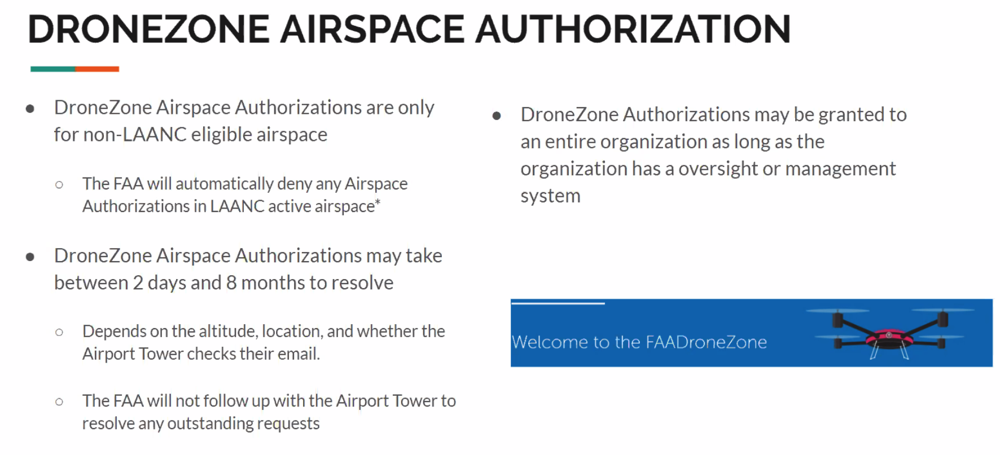
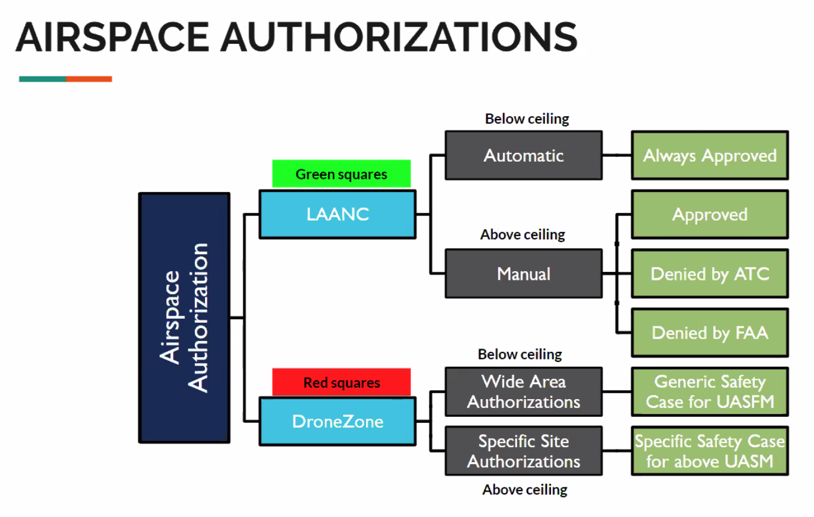
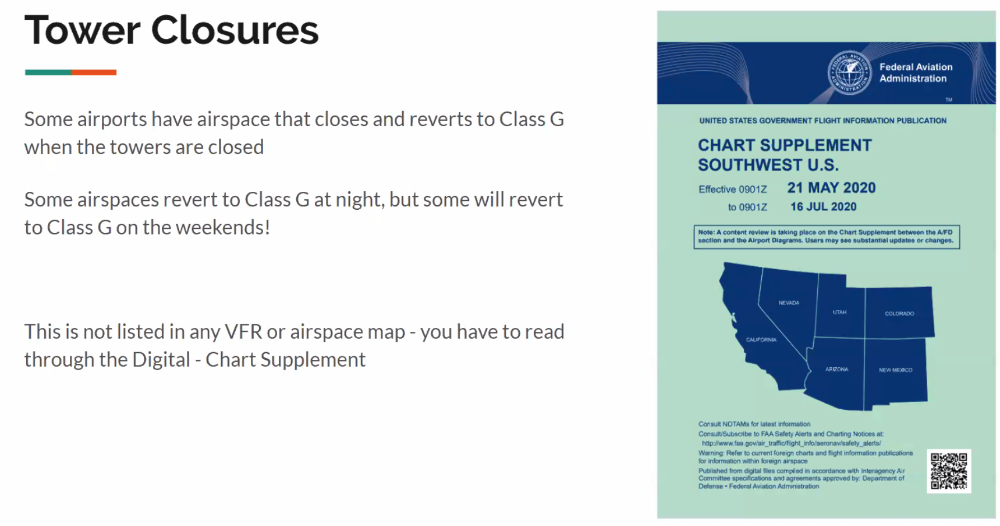
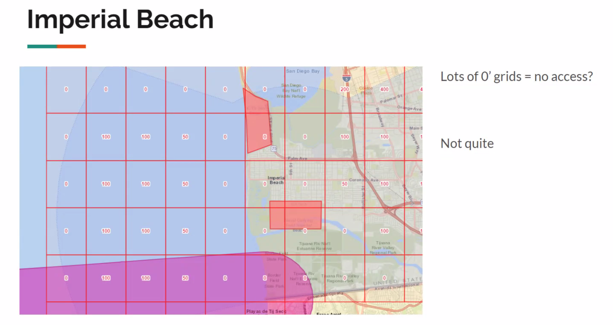
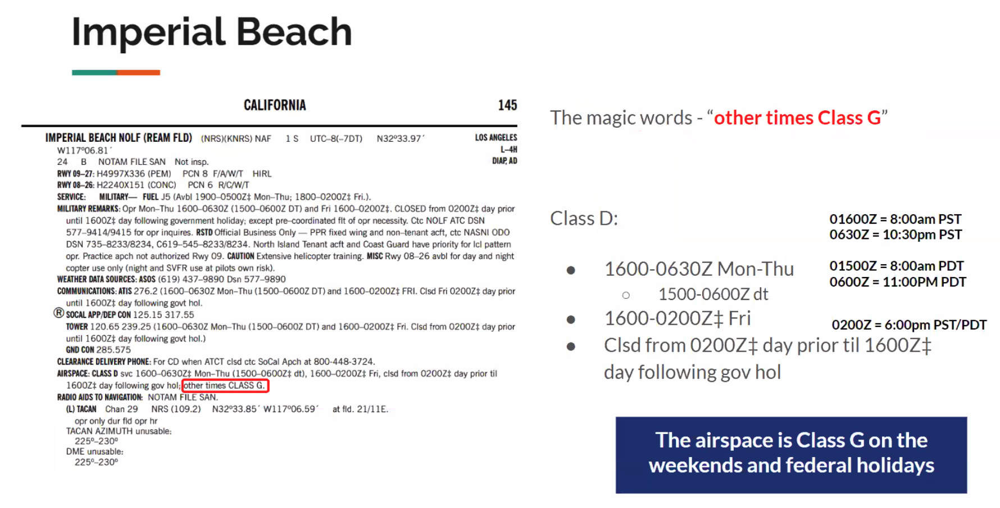
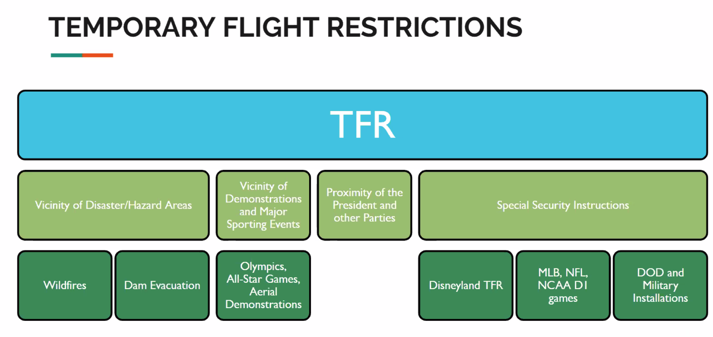
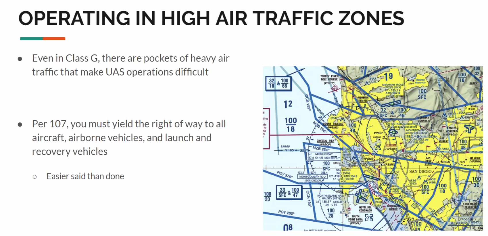
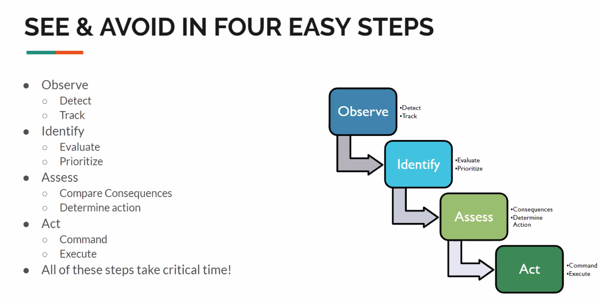
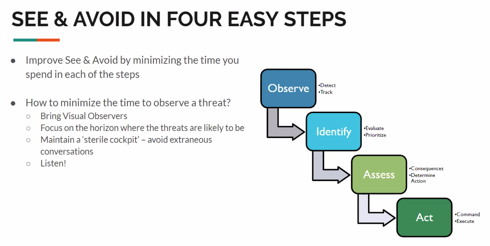
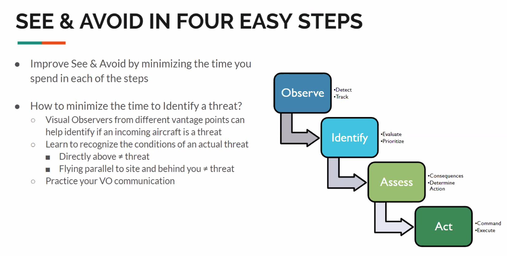
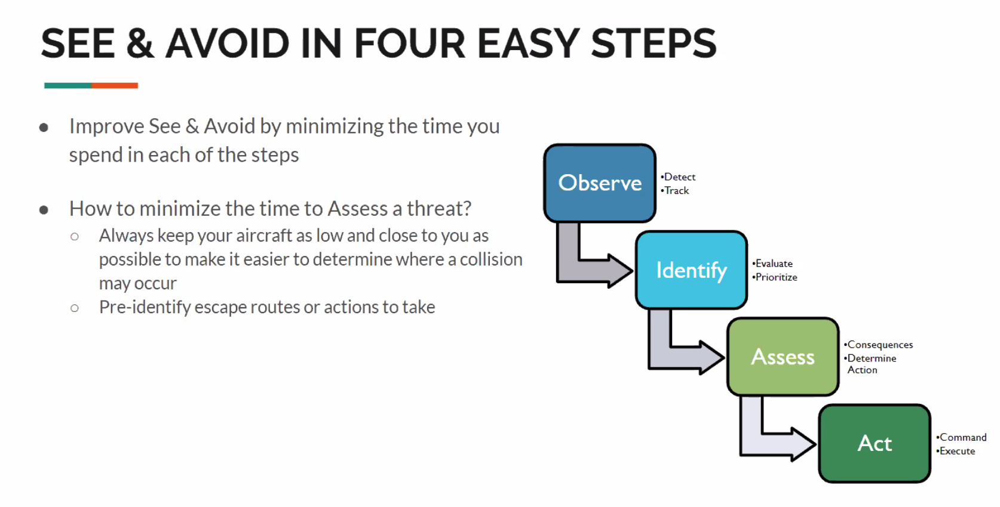
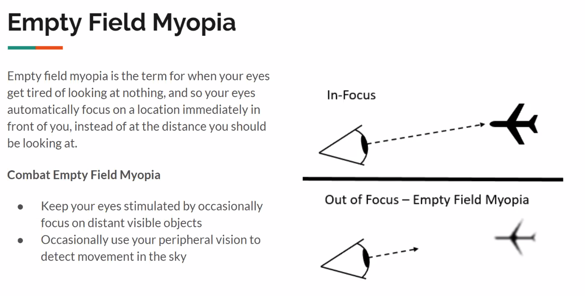
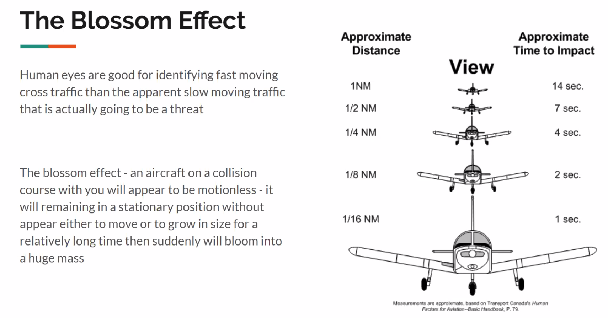
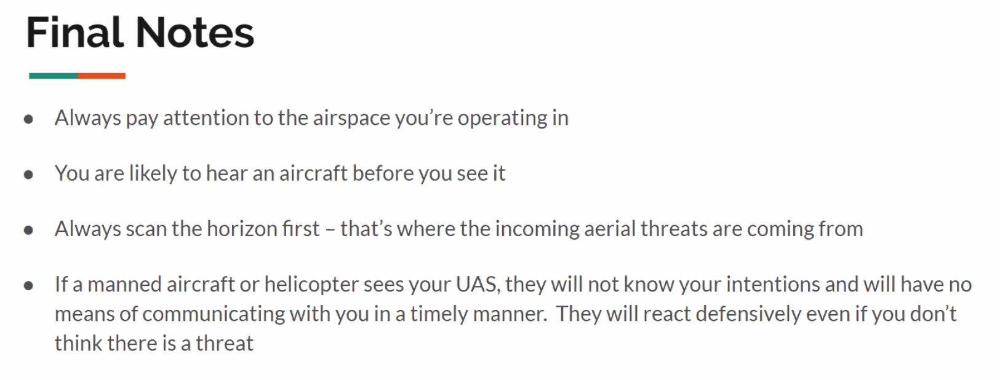
