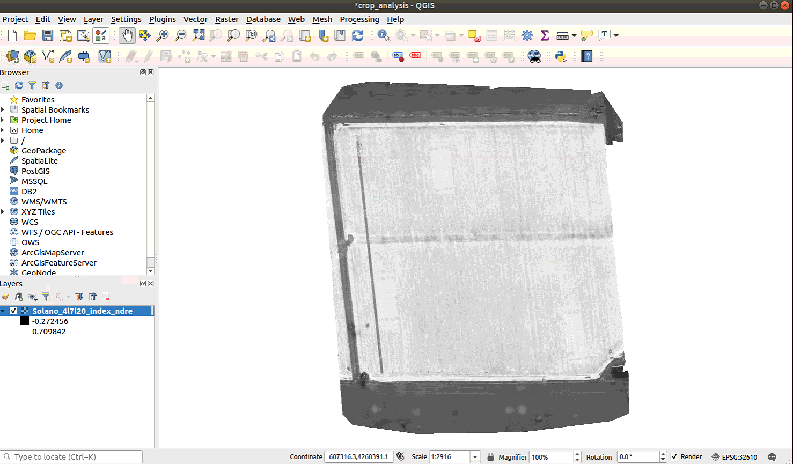

## todo list

- [x] ArcGIS Pro runs on Windows only
- [x] Pix4D Desktop runs on Windows only
- [x] Install the WebODM Lightning client and create your WebODM Lightning online account
- [ ] QGIS 'Step Zero' [Assignment](https://github.com/dronecamp/exercises/blob/master/qgis_step_zero.md)

## [OpenDroneMap](https://www.opendronemap.org/docs/)

- the installation from source version is free, need to pay for the stand alone installer for macOS  
- to install, follow [this](https://docs.opendronemap.org/installation.html#linux)
- if see `couldn't connect to Docker daemon at` error, use `sudo ./webodm.sh start`
- after installation, open a browser and enter `http://localhost:8000`

## [qgis](https://qgis.org/en/site/forusers/alldownloads.html)

- to start it on ubuntu, search `QGIS desktop` in the app center
- result of the tutorial is

