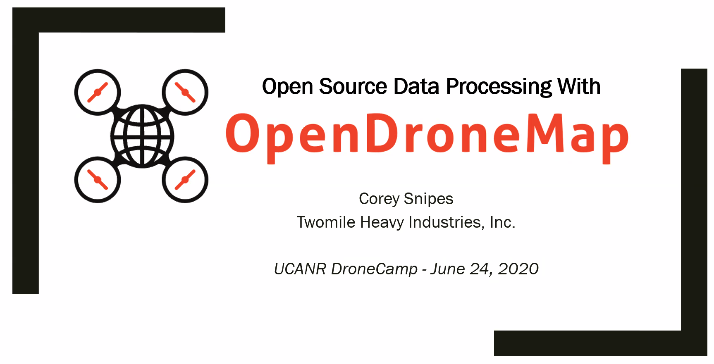

## information

2. Image Processing Pt. 2 Wednesday June 24, 10:00 - 11:50 am PDT
- Open Source Data Processing with OpenDroneMap

## tutorial

- [slides](https://drive.google.com/file/d/1D5et0f2i2TQhAEvURhvU6yRTs6wUc_CY/view)
- [step zero](https://docs.google.com/document/d/1q-OE1AbtCObimw8VFbbW6jG0Fvh49BmONglXt4xBUNc/edit)
- [data](https://github.com/coreysnipes/drone_dataset_brighton_beach)

## output

- sample dataset  

- IMAV 2014 dataset

## debug

- cannot login to WebODM in the browser using the WebODM Lightning credentials, need to use `./webodm.sh resetadminpassword yournewpass` to change the password
